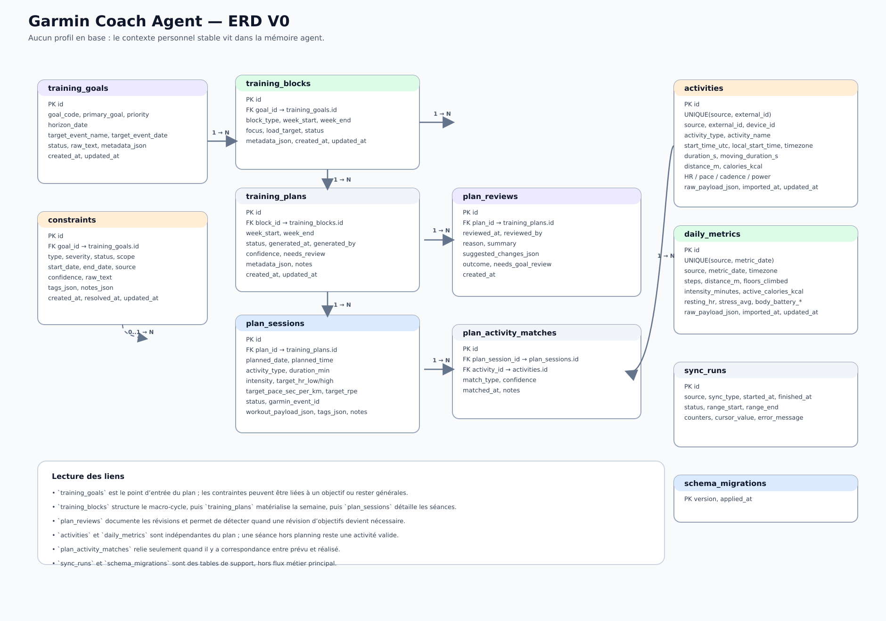

# Base de données

## Rôle

La base de données stocke ce qui est nécessaire pour raisonner sur l’entraînement, la récupération et la génération du plan hebdo.

## Choix V0

- SQLite en local
- schéma simple et lisible
- tables stables
- payload brut conservé quand utile pour debug, revue et évolution
- le plan courant est stocké en base
- les infos perso stables vivent dans la mémoire de l’agent, pas dans la DB
- migrations SQL maison, simples, exécutées par le projet Python

## Schéma relationnel V0

### Schéma visuel ER



### Principes

- des objectifs versionnés
- des contraintes semi-structurées avec texte brut + tags
- un cycle macro en blocs
- un plan hebdomadaire généré et versionné
- des séances planifiées exportables vers Garmin
- des séances réelles importées depuis Garmin
- des métriques journalières simples
- un historique des synchronisations
- une table de migrations
- pas de table de profil utilisateur : le contexte personnel stable est gardé côté mémoire agent

---

## Tables

### `training_goals`

Objectifs et événements cibles.

```sql
CREATE TABLE training_goals (
  id INTEGER PRIMARY KEY AUTOINCREMENT,

  goal_code TEXT,
  primary_goal TEXT NOT NULL,
  priority TEXT NOT NULL DEFAULT 'medium',
  horizon_date TEXT,

  target_event_name TEXT,
  target_event_date TEXT,
  target_event_priority TEXT,

  status TEXT NOT NULL DEFAULT 'active',
  raw_text TEXT,
  metadata_json TEXT,

  created_at TEXT NOT NULL DEFAULT CURRENT_TIMESTAMP,
  updated_at TEXT NOT NULL DEFAULT CURRENT_TIMESTAMP,

  UNIQUE (goal_code)
);
```

### `constraints`

Contraintes actives ou historisées, avec structure légère.

```sql
CREATE TABLE constraints (
  id INTEGER PRIMARY KEY AUTOINCREMENT,
  goal_id INTEGER,

  type TEXT NOT NULL,
  severity TEXT NOT NULL DEFAULT 'medium',
  status TEXT NOT NULL DEFAULT 'active',
  scope TEXT NOT NULL DEFAULT 'training',

  start_date TEXT NOT NULL,
  end_date TEXT,
  source TEXT NOT NULL DEFAULT 'user',
  confidence REAL NOT NULL DEFAULT 1.0,

  raw_text TEXT NOT NULL,
  tags_json TEXT,
  notes_json TEXT,

  created_at TEXT NOT NULL DEFAULT CURRENT_TIMESTAMP,
  resolved_at TEXT,
  updated_at TEXT NOT NULL DEFAULT CURRENT_TIMESTAMP,

  FOREIGN KEY (goal_id) REFERENCES training_goals(id)
);
```

### `training_blocks`

Découpage macro du cycle d’entraînement.

```sql
CREATE TABLE training_blocks (
  id INTEGER PRIMARY KEY AUTOINCREMENT,
  goal_id INTEGER NOT NULL,

  block_type TEXT NOT NULL,
  week_start TEXT NOT NULL,
  week_end TEXT NOT NULL,
  focus TEXT,
  load_target TEXT,
  status TEXT NOT NULL DEFAULT 'planned',
  metadata_json TEXT,

  created_at TEXT NOT NULL DEFAULT CURRENT_TIMESTAMP,
  updated_at TEXT NOT NULL DEFAULT CURRENT_TIMESTAMP,

  FOREIGN KEY (goal_id) REFERENCES training_goals(id)
);
```

### `training_plans`

Plan hebdomadaire généré.

```sql
CREATE TABLE training_plans (
  id INTEGER PRIMARY KEY AUTOINCREMENT,
  block_id INTEGER,

  week_start TEXT NOT NULL,
  week_end TEXT NOT NULL,
  status TEXT NOT NULL DEFAULT 'draft',
  generated_at TEXT NOT NULL DEFAULT CURRENT_TIMESTAMP,
  generated_by TEXT NOT NULL DEFAULT 'agent',
  confidence TEXT NOT NULL DEFAULT 'medium',
  needs_review INTEGER NOT NULL DEFAULT 0,

  metadata_json TEXT,
  notes TEXT,

  created_at TEXT NOT NULL DEFAULT CURRENT_TIMESTAMP,
  updated_at TEXT NOT NULL DEFAULT CURRENT_TIMESTAMP,

  FOREIGN KEY (block_id) REFERENCES training_blocks(id)
);
```

### `plan_sessions`

Séances planifiées dans une semaine donnée.

```sql
CREATE TABLE plan_sessions (
  id INTEGER PRIMARY KEY AUTOINCREMENT,
  plan_id INTEGER NOT NULL,

  planned_date TEXT NOT NULL,
  planned_time TEXT,
  activity_type TEXT NOT NULL,
  duration_min INTEGER NOT NULL,

  intensity TEXT,
  target_hr_low INTEGER,
  target_hr_high INTEGER,
  target_pace_sec_per_km INTEGER,
  target_rpe INTEGER,

  status TEXT NOT NULL DEFAULT 'proposed',
  garmin_event_id TEXT,
  workout_payload_json TEXT,
  tags_json TEXT,
  notes TEXT,

  created_at TEXT NOT NULL DEFAULT CURRENT_TIMESTAMP,
  updated_at TEXT NOT NULL DEFAULT CURRENT_TIMESTAMP,

  FOREIGN KEY (plan_id) REFERENCES training_plans(id)
);
```

### `plan_reviews`

Revue du plan et des ajustements.

Cette table garde la trace de *pourquoi* le plan a changé, et permet de savoir si une révision d’objectifs doit être proposée.

```sql
CREATE TABLE plan_reviews (
  id INTEGER PRIMARY KEY AUTOINCREMENT,
  plan_id INTEGER NOT NULL,

  reviewed_at TEXT NOT NULL DEFAULT CURRENT_TIMESTAMP,
  reviewed_by TEXT NOT NULL DEFAULT 'agent',
  reason TEXT NOT NULL,
  summary TEXT,
  suggested_changes_json TEXT,
  outcome TEXT NOT NULL DEFAULT 'kept',
  needs_goal_review INTEGER NOT NULL DEFAULT 0,

  created_at TEXT NOT NULL DEFAULT CURRENT_TIMESTAMP,

  FOREIGN KEY (plan_id) REFERENCES training_plans(id)
);
```

### `plan_activity_matches`

Correspondance optionnelle entre une séance planifiée et une activité réelle.

Une activité peut exister sans correspondance de plan si la séance a été faite hors planning.

```sql
CREATE TABLE plan_activity_matches (
  id INTEGER PRIMARY KEY AUTOINCREMENT,
  plan_session_id INTEGER NOT NULL,
  activity_id INTEGER NOT NULL,

  match_type TEXT NOT NULL DEFAULT 'manual',
  confidence REAL NOT NULL DEFAULT 1.0,
  matched_at TEXT NOT NULL DEFAULT CURRENT_TIMESTAMP,
  notes TEXT,

  FOREIGN KEY (plan_session_id) REFERENCES plan_sessions(id),
  FOREIGN KEY (activity_id) REFERENCES activities(id),
  UNIQUE (plan_session_id, activity_id)
);
```

### `activities`

Séances réelles importées depuis Garmin.

Ces lignes sont indépendantes du plan.
Elles peuvent être reliées à un `plan_session` via `plan_activity_matches`, mais ce n’est pas obligatoire.

```sql
CREATE TABLE activities (
  id INTEGER PRIMARY KEY AUTOINCREMENT,

  source TEXT NOT NULL DEFAULT 'garmin',
  external_id TEXT NOT NULL,
  device_id TEXT,
  activity_type TEXT NOT NULL,
  activity_name TEXT,

  start_time_utc TEXT NOT NULL,
  local_start_time TEXT,
  timezone TEXT,
  duration_s INTEGER NOT NULL,
  moving_duration_s INTEGER,

  distance_m REAL,
  elevation_gain_m REAL,
  elevation_loss_m REAL,
  calories_kcal INTEGER,

  avg_hr INTEGER,
  max_hr INTEGER,

  avg_speed_mps REAL,
  max_speed_mps REAL,
  avg_pace_sec_per_km REAL,
  avg_cadence_rpm REAL,
  max_cadence_rpm REAL,

  steps INTEGER,
  avg_power_w REAL,
  max_power_w REAL,
  training_effect_aerobic REAL,
  training_effect_anaerobic REAL,
  perceived_effort INTEGER,

  is_manual INTEGER NOT NULL DEFAULT 0,
  raw_payload_json TEXT,
  imported_at TEXT NOT NULL DEFAULT CURRENT_TIMESTAMP,
  updated_at TEXT NOT NULL DEFAULT CURRENT_TIMESTAMP,

  UNIQUE (source, external_id)
);
```

### `daily_metrics`

Métriques journalières utiles au readiness.

Cette table est au niveau du jour, pas au niveau de la séance.
Elle n’a pas de clé étrangère vers `activities`.
Un jour sans activité peut quand même avoir une ligne de métriques.

```sql
CREATE TABLE daily_metrics (
  id INTEGER PRIMARY KEY AUTOINCREMENT,

  source TEXT NOT NULL DEFAULT 'garmin',
  metric_date TEXT NOT NULL,
  timezone TEXT,

  steps INTEGER,
  distance_m REAL,
  floors_climbed INTEGER,
  intensity_minutes INTEGER,
  active_calories_kcal INTEGER,
  total_calories_kcal INTEGER,

  resting_hr INTEGER,
  min_hr INTEGER,
  max_hr INTEGER,
  avg_hr INTEGER,

  stress_avg REAL,
  stress_max INTEGER,

  body_battery_start INTEGER,
  body_battery_end INTEGER,
  body_battery_min INTEGER,
  body_battery_max INTEGER,

  respiration_avg REAL,
  pulse_ox_avg REAL,

  raw_payload_json TEXT,
  imported_at TEXT NOT NULL DEFAULT CURRENT_TIMESTAMP,
  updated_at TEXT NOT NULL DEFAULT CURRENT_TIMESTAMP,

  UNIQUE (source, metric_date)
);
```

### `sync_runs`

Historique des synchronisations.

```sql
CREATE TABLE sync_runs (
  id INTEGER PRIMARY KEY AUTOINCREMENT,

  source TEXT NOT NULL DEFAULT 'garmin',
  sync_type TEXT NOT NULL,
  started_at TEXT NOT NULL,
  finished_at TEXT,
  status TEXT NOT NULL,

  range_start TEXT,
  range_end TEXT,

  activities_seen INTEGER NOT NULL DEFAULT 0,
  activities_inserted INTEGER NOT NULL DEFAULT 0,
  activities_updated INTEGER NOT NULL DEFAULT 0,
  daily_metrics_seen INTEGER NOT NULL DEFAULT 0,
  daily_metrics_upserted INTEGER NOT NULL DEFAULT 0,

  cursor_value TEXT,
  error_message TEXT
);
```

### `schema_migrations`

Historique des migrations.

```sql
CREATE TABLE schema_migrations (
  version TEXT PRIMARY KEY,
  applied_at TEXT NOT NULL DEFAULT CURRENT_TIMESTAMP
);
```

## Migrations

### Stratégie V0

On utilise un système de migrations **maison**, simple.

- un dossier `migrations/`
- un fichier SQL par migration
- une version monotone : `0001`, `0002`, `0003`, etc.
- une ligne par migration appliquée dans `schema_migrations`

### Structure attendue

```text
migrations/
├── 0001_init.sql
├── 0002_add_sync_runs.sql
└── 0003_plan_session_status.sql
```

### Règles

- une migration appliquée ne doit plus être modifiée
- une évolution de schéma se fait dans un nouveau fichier
- le runner applique seulement les versions absentes de `schema_migrations`
- les scripts du projet doivent pouvoir démarrer sur une DB vide et la mettre à niveau automatiquement

### Exécution

Le projet Python porte un runner de migrations minimal dans `garmin_coach/db.py`.

Le flow attendu est :

1. ouverture de la connexion SQLite
2. création de `schema_migrations` si besoin
3. application des migrations manquantes dans l’ordre
4. poursuite du script métier

### SQLite

Quand une migration n’est pas faisable par simple `ALTER TABLE`, on reconstruit explicitement :

- création d’une nouvelle table
- copie des données
- suppression / renommage

Pas de magie implicite.

---

## Détail des champs

### `training_goals`

| Champ | Type | Contraintes | Description |
|---|---|---|---|
| id | INTEGER | PK, AUTOINCREMENT | Identifiant de l’objectif |
| goal_code | TEXT | nullable, UNIQUE | Code stable optionnel |
| primary_goal | TEXT | NOT NULL | Objectif principal |
| priority | TEXT | NOT NULL, DEFAULT 'medium' | Priorité |
| horizon_date | TEXT | nullable | Horizon visé |
| target_event_name | TEXT | nullable | Nom d’événement cible |
| target_event_date | TEXT | nullable | Date d’événement cible |
| target_event_priority | TEXT | nullable | Priorité de l’événement |
| status | TEXT | NOT NULL, DEFAULT 'active' | Statut |
| raw_text | TEXT | nullable | Source texte libre |
| metadata_json | TEXT | nullable | Métadonnées JSON |
| created_at | TEXT | NOT NULL, DEFAULT CURRENT_TIMESTAMP | Date de création |
| updated_at | TEXT | NOT NULL, DEFAULT CURRENT_TIMESTAMP | Date de mise à jour |

### `constraints`

| Champ | Type | Contraintes | Description |
|---|---|---|---|
| id | INTEGER | PK, AUTOINCREMENT | Identifiant de contrainte |
| goal_id | INTEGER | nullable, FK → training_goals.id | Objectif lié si pertinent |
| type | TEXT | NOT NULL | Type normalisé |
| severity | TEXT | NOT NULL, DEFAULT 'medium' | Intensité |
| status | TEXT | NOT NULL, DEFAULT 'active' | Statut |
| scope | TEXT | NOT NULL, DEFAULT 'training' | Périmètre |
| start_date | TEXT | NOT NULL | Début de validité |
| end_date | TEXT | nullable | Fin de validité |
| source | TEXT | NOT NULL, DEFAULT 'user' | Origine |
| confidence | REAL | NOT NULL, DEFAULT 1.0 | Confiance |
| raw_text | TEXT | NOT NULL | Texte brut |
| tags_json | TEXT | nullable | Tags JSON |
| notes_json | TEXT | nullable | Notes JSON |
| created_at | TEXT | NOT NULL, DEFAULT CURRENT_TIMESTAMP | Date de création |
| resolved_at | TEXT | nullable | Date de résolution |
| updated_at | TEXT | NOT NULL, DEFAULT CURRENT_TIMESTAMP | Date de mise à jour |

### `training_blocks`

| Champ | Type | Contraintes | Description |
|---|---|---|---|
| id | INTEGER | PK, AUTOINCREMENT | Identifiant du bloc |
| goal_id | INTEGER | NOT NULL, FK → training_goals.id | Objectif parent |
| block_type | TEXT | NOT NULL | Type de bloc |
| week_start | TEXT | NOT NULL | Début de fenêtre |
| week_end | TEXT | NOT NULL | Fin de fenêtre |
| focus | TEXT | nullable | Focus du bloc |
| load_target | TEXT | nullable | Cible de charge |
| status | TEXT | NOT NULL, DEFAULT 'planned' | Statut |
| metadata_json | TEXT | nullable | Métadonnées JSON |
| created_at | TEXT | NOT NULL, DEFAULT CURRENT_TIMESTAMP | Date de création |
| updated_at | TEXT | NOT NULL, DEFAULT CURRENT_TIMESTAMP | Date de mise à jour |

### `training_plans`

| Champ | Type | Contraintes | Description |
|---|---|---|---|
| id | INTEGER | PK, AUTOINCREMENT | Identifiant du plan |
| block_id | INTEGER | nullable, FK → training_blocks.id | Bloc parent |
| week_start | TEXT | NOT NULL | Début de semaine |
| week_end | TEXT | NOT NULL | Fin de semaine |
| status | TEXT | NOT NULL, DEFAULT 'draft' | Statut |
| generated_at | TEXT | NOT NULL, DEFAULT CURRENT_TIMESTAMP | Date de génération |
| generated_by | TEXT | NOT NULL, DEFAULT 'agent' | Source de génération |
| confidence | TEXT | NOT NULL, DEFAULT 'medium' | Niveau de confiance |
| needs_review | INTEGER | NOT NULL, DEFAULT 0 | Drapeau de revue |
| metadata_json | TEXT | nullable | Métadonnées JSON |
| notes | TEXT | nullable | Notes libres |
| created_at | TEXT | NOT NULL, DEFAULT CURRENT_TIMESTAMP | Date de création |
| updated_at | TEXT | NOT NULL, DEFAULT CURRENT_TIMESTAMP | Date de mise à jour |

### `plan_sessions`

| Champ | Type | Contraintes | Description |
|---|---|---|---|
| id | INTEGER | PK, AUTOINCREMENT | Identifiant de séance prévue |
| plan_id | INTEGER | NOT NULL, FK → training_plans.id | Plan parent |
| planned_date | TEXT | NOT NULL | Date prévue |
| planned_time | TEXT | nullable | Heure prévue |
| activity_type | TEXT | NOT NULL | Type d’activité |
| duration_min | INTEGER | NOT NULL | Durée cible |
| intensity | TEXT | nullable | Intensité cible |
| target_hr_low | INTEGER | nullable | Borne basse FC |
| target_hr_high | INTEGER | nullable | Borne haute FC |
| target_pace_sec_per_km | INTEGER | nullable | Allure cible |
| target_rpe | INTEGER | nullable | RPE cible |
| status | TEXT | NOT NULL, DEFAULT 'proposed' | Statut |
| garmin_event_id | TEXT | nullable | Id Garmin si exporté |
| workout_payload_json | TEXT | nullable | Payload exportable |
| tags_json | TEXT | nullable | Tags JSON |
| notes | TEXT | nullable | Notes libres |
| created_at | TEXT | NOT NULL, DEFAULT CURRENT_TIMESTAMP | Date de création |
| updated_at | TEXT | NOT NULL, DEFAULT CURRENT_TIMESTAMP | Date de mise à jour |

### `plan_reviews`

| Champ | Type | Contraintes | Description |
|---|---|---|---|
| id | INTEGER | PK, AUTOINCREMENT | Identifiant de revue |
| plan_id | INTEGER | NOT NULL, FK → training_plans.id | Plan concerné |
| reviewed_at | TEXT | NOT NULL, DEFAULT CURRENT_TIMESTAMP | Date de revue |
| reviewed_by | TEXT | NOT NULL, DEFAULT 'agent' | Relecteur |
| reason | TEXT | NOT NULL | Raison de la revue |
| summary | TEXT | nullable | Résumé |
| suggested_changes_json | TEXT | nullable | Changements suggérés |
| outcome | TEXT | NOT NULL, DEFAULT 'kept' | Résultat |
| needs_goal_review | INTEGER | NOT NULL, DEFAULT 0 | Demande de révision des objectifs |
| created_at | TEXT | NOT NULL, DEFAULT CURRENT_TIMESTAMP | Date de création |

## Machine d’état

### Plan

- `draft` : plan en cours d’édition locale
- `active` : plan validé et prêt à vivre côté coaching
- `sent` : plan poussé vers Garmin
- `archived` : plan clos / conservé pour historique

### Séance de plan

- `draft` : séance créée mais encore librement modifiable
- `proposed` : séance proposée dans un plan validé mais pas encore exportée
- `exported` : séance poussée vers Garmin
- `done` : séance réalisée et reconnue dans le réel
- `skipped` : séance sautée
- `canceled` : séance annulée

### Règles de workflow

- la validation d’un plan peut faire passer ses séances de `draft` à `proposed`
- `delete` n’est autorisé que sur une séance non exportée et non réalisée
- un changement de contenu sur une séance validée se fait plutôt par remplacement explicite
- la réconciliation entre plan et réel ne doit pas casser l’historique des séances exportées ou réalisées

### `plan_activity_matches`

| Champ | Type | Contraintes | Description |
|---|---|---|---|
| id | INTEGER | PK, AUTOINCREMENT | Identifiant du lien |
| plan_session_id | INTEGER | NOT NULL, FK → plan_sessions.id | Séance planifiée |
| activity_id | INTEGER | NOT NULL, FK → activities.id | Activité réelle |
| match_type | TEXT | NOT NULL, DEFAULT 'manual' | Type de correspondance |
| confidence | REAL | NOT NULL, DEFAULT 1.0 | Confiance |
| matched_at | TEXT | NOT NULL, DEFAULT CURRENT_TIMESTAMP | Date de rapprochement |
| notes | TEXT | nullable | Notes |

### `activities`

| Champ | Type | Contraintes | Description |
|---|---|---|---|
| id | INTEGER | PK, AUTOINCREMENT | Identifiant de séance réelle |
| source | TEXT | NOT NULL, DEFAULT 'garmin' | Source |
| external_id | TEXT | NOT NULL | Id externe |
| device_id | TEXT | nullable | Id appareil |
| activity_type | TEXT | NOT NULL | Type d’activité |
| activity_name | TEXT | nullable | Nom |
| start_time_utc | TEXT | NOT NULL | Début UTC |
| local_start_time | TEXT | nullable | Début local |
| timezone | TEXT | nullable | Fuseau horaire |
| duration_s | INTEGER | NOT NULL | Durée totale |
| moving_duration_s | INTEGER | nullable | Durée en mouvement |
| distance_m | REAL | nullable | Distance |
| elevation_gain_m | REAL | nullable | D+ |
| elevation_loss_m | REAL | nullable | D- |
| calories_kcal | INTEGER | nullable | Calories |
| avg_hr | INTEGER | nullable | FC moyenne |
| max_hr | INTEGER | nullable | FC max |
| avg_speed_mps | REAL | nullable | Vitesse moyenne |
| max_speed_mps | REAL | nullable | Vitesse max |
| avg_pace_sec_per_km | REAL | nullable | Allure moyenne |
| avg_cadence_rpm | REAL | nullable | Cadence moyenne |
| max_cadence_rpm | REAL | nullable | Cadence max |
| steps | INTEGER | nullable | Pas |
| avg_power_w | REAL | nullable | Puissance moyenne |
| max_power_w | REAL | nullable | Puissance max |
| training_effect_aerobic | REAL | nullable | Effet aérobie |
| training_effect_anaerobic | REAL | nullable | Effet anaérobie |
| perceived_effort | INTEGER | nullable | Effort perçu |
| is_manual | INTEGER | NOT NULL, DEFAULT 0 | Saisie manuelle |
| raw_payload_json | TEXT | nullable | Payload brut |
| imported_at | TEXT | NOT NULL, DEFAULT CURRENT_TIMESTAMP | Date d’import |
| updated_at | TEXT | NOT NULL, DEFAULT CURRENT_TIMESTAMP | Date de mise à jour |

### `daily_metrics`

| Champ | Type | Contraintes | Description |
|---|---|---|---|
| id | INTEGER | PK, AUTOINCREMENT | Identifiant |
| source | TEXT | NOT NULL, DEFAULT 'garmin' | Source |
| metric_date | TEXT | NOT NULL | Date |
| timezone | TEXT | nullable | Fuseau horaire |
| steps | INTEGER | nullable | Pas |
| distance_m | REAL | nullable | Distance journalière |
| floors_climbed | INTEGER | nullable | Étages |
| intensity_minutes | INTEGER | nullable | Minutes d’intensité |
| active_calories_kcal | INTEGER | nullable | Calories actives |
| total_calories_kcal | INTEGER | nullable | Calories totales |
| resting_hr | INTEGER | nullable | FC repos |
| min_hr | INTEGER | nullable | FC min |
| max_hr | INTEGER | nullable | FC max |
| avg_hr | INTEGER | nullable | FC moyenne |
| stress_avg | REAL | nullable | Stress moyen |
| stress_max | INTEGER | nullable | Stress max |
| body_battery_start | INTEGER | nullable | Body Battery début |
| body_battery_end | INTEGER | nullable | Body Battery fin |
| body_battery_min | INTEGER | nullable | Body Battery min |
| body_battery_max | INTEGER | nullable | Body Battery max |
| respiration_avg | REAL | nullable | Respiration moyenne |
| pulse_ox_avg | REAL | nullable | SpO2 moyenne |
| raw_payload_json | TEXT | nullable | Payload brut |
| imported_at | TEXT | NOT NULL, DEFAULT CURRENT_TIMESTAMP | Date d’import |
| updated_at | TEXT | NOT NULL, DEFAULT CURRENT_TIMESTAMP | Date de mise à jour |

### `sync_runs`

| Champ | Type | Contraintes | Description |
|---|---|---|---|
| id | INTEGER | PK, AUTOINCREMENT | Identifiant |
| source | TEXT | NOT NULL, DEFAULT 'garmin' | Source |
| sync_type | TEXT | NOT NULL | Type de sync |
| started_at | TEXT | NOT NULL | Début |
| finished_at | TEXT | nullable | Fin |
| status | TEXT | NOT NULL | Statut |
| range_start | TEXT | nullable | Début de plage |
| range_end | TEXT | nullable | Fin de plage |
| activities_seen | INTEGER | NOT NULL, DEFAULT 0 | Nb vues |
| activities_inserted | INTEGER | NOT NULL, DEFAULT 0 | Nb insérées |
| activities_updated | INTEGER | NOT NULL, DEFAULT 0 | Nb mises à jour |
| daily_metrics_seen | INTEGER | NOT NULL, DEFAULT 0 | Nb vues |
| daily_metrics_upserted | INTEGER | NOT NULL, DEFAULT 0 | Nb upsertées |
| cursor_value | TEXT | nullable | Curseur |
| error_message | TEXT | nullable | Message d’erreur |

### `schema_migrations`

| Champ | Type | Contraintes | Description |
|---|---|---|---|
| version | TEXT | PK | Version de migration |
| applied_at | TEXT | NOT NULL, DEFAULT CURRENT_TIMESTAMP | Date d’application |

## Index recommandés

```sql
CREATE INDEX idx_training_goals_status
  ON training_goals(status);

CREATE INDEX idx_constraints_status
  ON constraints(status);

CREATE INDEX idx_training_blocks_goal_week
  ON training_blocks(goal_id, week_start);

CREATE INDEX idx_training_plans_week_start
  ON training_plans(week_start);

CREATE INDEX idx_plan_sessions_plan_date
  ON plan_sessions(plan_id, planned_date);

CREATE INDEX idx_plan_reviews_plan_reviewed_at
  ON plan_reviews(plan_id, reviewed_at);

CREATE INDEX idx_activities_start_time
  ON activities(start_time_utc);

CREATE INDEX idx_activities_type_start
  ON activities(activity_type, start_time_utc);

CREATE INDEX idx_daily_metrics_date
  ON daily_metrics(metric_date);
```

## Non-objectifs V0

- sommeil
- samples HR / stress
- GPS point par point
- laps / splits
- temps réel

## Enums canoniques

Les champs de statut et de source doivent rester cohérents entre la DB et les scripts.

### Plans

- `training_plans.status` → `draft | active | sent | archived`

### Séances de plan

- `plan_sessions.status` → `draft | proposed | exported | done | skipped | canceled`

### Contraintes

- `constraints.status` → `active | inactive`

### Activités

- `activities.source` → `garmin | manual`
- `activities` n’ont pas de statut canonique propre en V0 : ce sont des enregistrements réels importés ou saisis, pas des objets de workflow.

### Matches

- `plan_activity_matches.match_type` → `manual | inferred | imported`

### Revue

- `plan_reviews.outcome` → `kept | adapted | reset`

## Idée générale du schéma

Le schéma doit rester lisible par les scripts de coaching, pas refléter tout Garmin.
Il doit aussi permettre de relier proprement : mémoire agent → objectifs/contraintes stables, DB → plan courant et historique.
